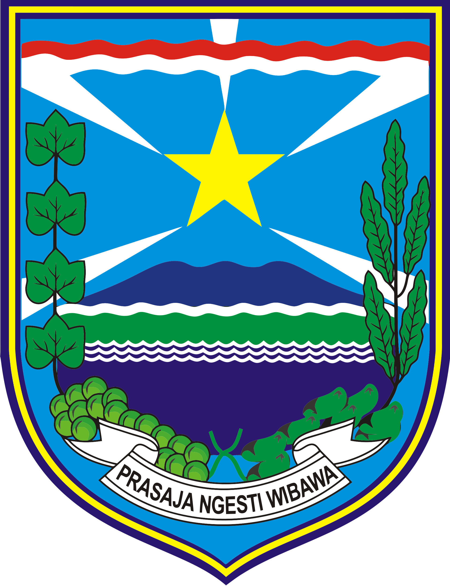

<div align="center">
  

  # 🗺️ PetaBudaya Probolinggo

  **Jelajah Budaya Kabupaten Probolinggo**

  [](https://nextjs.org)
  [](https://www.typescriptlang.org)
  [](https://tailwindcss.com)
  [](https://maplibre.org)
  [](./LICENSE)
  [](./CONTRIBUTING.md)

</div>

---

## 📖 Tentang

**PetaBudaya Probolinggo** adalah peta interaktif resmi yang menampilkan sebaran **Cagar Budaya**, **Warisan Budaya Tak Benda (WBTB)**, dan **Objek Pemajuan Kebudayaan (OPK)** di Kabupaten Probolinggo, Jawa Timur.

Dibangun untuk **Dinas Kebudayaan dan Pariwisata Kabupaten Probolinggo** sebagai etalase digital inventaris budaya daerah, menggantikan dokumen PDF dan spreadsheet yang sebelumnya tersebar.

---

## ✨ Fitur

- **🗺️ Peta Interaktif** — Sebaran 72+ situs budaya dalam peta interaktif berbasis MapLibre GL JS
- **🎯 Clustering** — Grid-based cluster otomatis saat zoom-out, individual marker saat zoom-in
- **🏷️ Multi-Layer Filter** — Toggle Cagar Budaya, ODCB, WBTB secara independen
- **📋 Katalog Lengkap** — Filter per tipe, kecamatan; eksplorasi Cagar Budaya & WBTB
- **🎠 Carousel WBTB** — Slideshow 6 Warisan Budaya Tak Benda dengan ilustrasi SVG khas
- **📜 Scroll-Snap OPK** — 10 kategori Objek Pemajuan Kebudayaan dengan navigasi animatif
- **♿ Aksesibilitas** — Skip-to-content, keyboard navigation, ARIA roles, reduced-motion support
- **📱 Responsif** — Mobile-first: sidebar berubah jadi bottom bar di layar kecil
- **🌐 SEO-Ready** — Metadata Open Graph, sitemap.xml, robots.txt, semantic HTML

---

## 🛠️ Tech Stack

| Layer | Teknologi |
|-------|-----------|
| **Framework** | [Next.js 16](https://nextjs.org) (App Router + Turbopack) |
| **Language** | [TypeScript](https://www.typescriptlang.org) 5 |
| **Styling** | [Tailwind CSS](https://tailwindcss.com) 4 + Custom Design Tokens |
| **Animation** | [Framer Motion](https://www.framer.com/motion/) 12 |
| **Map** | [react-map-gl](https://visgl.github.io/react-map-gl/) 8 + [MapLibre GL JS](https://maplibre.org) 5 |
| **Map Tiles** | [MapTiler](https://www.maptiler.com) Streets v2 Light |
| **Fonts** | Playfair Display · Plus Jakarta Sans · JetBrains Mono (next/font) |
| **Icons** | [Lucide React](https://lucide.dev) |
| **Testing** | [Vitest](https://vitest.dev) 4 |
| **Linting** | [ESLint](https://eslint.org) 9 (Flat Config) + next/core-web-vitals |

---

## 🚀 Mulai Cepat

### Prasyarat
- **Node.js** ≥ 20
- **npm** ≥ 10

### Install & Jalankan

```bash
# Clone repository
git clone https://github.com/Tiyouw/petabudaya-probolinggo.git
cd petabudaya-probolinggo

# Install dependencies
npm install

# Setup environment variable
cp .env.example .env.local
# Edit .env.local dengan MapTiler API key Anda

# Jalankan development server
npm run dev
```

Buka [http://localhost:3000](http://localhost:3000).

### Build Production

```bash
npm run build
npm start
```

### Menjalankan Test

```bash
npx vitest run --config lib/__tests__/vitest.config.ts
```

---

## 🔐 Keamanan

- **CSP Headers** — Content-Security-Policy, X-Content-Type-Options, X-Frame-Options, Referrer-Policy
- **Environment Variables** — API key disimpan di `.env.local`, tidak pernah di-commit
- **No `dangerouslySetInnerHTML`** — Semua SVG dirender sebagai React component proper
- **Input Validation** — Validasi range lat/lng sebelum generate URL Google Maps
- **Error Boundary** — Global `error.tsx` menangkap crash dengan fallback UI

---

## 📁 Struktur Proyek

```
petabudaya-probolinggo/
├── app/                          # Next.js App Router pages & layout
│   ├── layout.tsx                # Root layout (metadata, fonts, CSP)
│   ├── page.tsx                  # Single-page app entry
│   ├── globals.css               # Design tokens & base styles
│   ├── error.tsx                 # Global error boundary
│   ├── robots.ts                 # robots.txt config
│   └── sitemap.ts                # sitemap.xml config
├── components/
│   ├── layout/                   # Sidebar, Footer
│   ├── hero/                     # Hero section
│   ├── stats/                    # Statistics section
│   ├── map/                      # CultureMap (react-map-gl) + PinSvg + filter bar
│   ├── heritage/                 # Cagar Budaya section + filter
│   ├── wbtb/                     # WBTB showcase + carousel
│   ├── opk/                      # OPK scroll-snap experience
│   ├── scroll/                   # Scroll progress navigation
│   └── ui/                       # Badge, CulturalCard, reusable components
├── data/                         # TypeScript data files (static, CMS-ready)
│   ├── cultural-sites.ts         # 72+ Cagar Budaya & ODCB items
│   ├── wbtb.ts                   # 6 Warisan Budaya Tak Benda
│   ├── opk.ts                    # 10 kategori Objek Pemajuan Kebudayaan
│   ├── map-regions.ts            # Centroid kecamatan
│   └── types.ts                  # TypeScript type definitions
├── hooks/                        # Custom hooks
│   ├── useMapFilter.ts           # Map layer toggle state
│   └── useScrollSpy.ts           # Scroll position detection
├── lib/                          # Utility functions
│   ├── map-utils.ts              # Map bounds, pin badges, URL builders
│   ├── filters.ts                # Client-side filter utilities
│   ├── stats.ts                  # Statistics calculations
│   └── __tests__/                # Unit tests (Vitest)
│       ├── filters.test.ts
│       ├── map-utils.test.ts
│       ├── stats.test.ts
│       └── vitest.config.ts
├── public/                       # Static assets (logos, favicon)
├── docs/                         # Documentation & planning
├── .env.example                  # Environment variable template
├── .env.local                    # Local environment (git-ignored)
├── next.config.ts                # Next.js config (headers, CSP)
├── eslint.config.mjs             # ESLint 9 flat config
├── tsconfig.json                 # TypeScript config
└── package.json
```

---

## 📊 Data

### Sumber

| Sumber | Jenis Data |
|--------|-----------|
| Dokumen Dinas Kebudayaan & Pariwisata | Cagar Budaya, ODCB, WBTB, OPK |
| OpenStreetMap / Nominatim | Geocoding koordinat (63 titik) |
| DapoBud (Kemendikbud) | Registrasi WBTB nasional |

### Prinsip Data

- **No fake precision** — Tidak ada koordinat yang dikarang; `approx-district` ditandai jelas
- **Traceability** — Setiap item memiliki metadata `sources[]` yang merujuk ke dokumen asli
- **Confidence levels** — `official` > `source-backed` > `needs-validation`
- **Badge visual** — 🟠 `📍 Lokasi Perkiraan` untuk koordinat non-presisi; ⚠️ `⚠️ Perlu Validasi` untuk data konflik

---

## 🤝 Kontribusi

Kontribusi terbuka untuk pengembang dari **Dinas Kebudayaan dan Pariwisata Kabupaten Probolinggo** dan komunitas.

### Panduan Umum

1. Fork repository ini
2. Buat branch fitur (`git checkout -b feat/nama-fitur`)
3. Commit perubahan (`git commit -m 'feat: deskripsi singkat'`)
4. Push ke branch (`git push origin feat/nama-fitur`)
5. Buka Pull Request

### Commit Convention

Gunakan format [Conventional Commits](https://www.conventionalcommits.org/):
- `feat:` — fitur baru
- `fix:` — perbaikan bug
- `docs:` — dokumentasi
- `refactor:` — refactoring kode
- `test:` — penambahan/perbaikan test
- `chore:` — maintenance (deps, config, dll.)

### Sebelum PR

```bash
npm run lint          # ESLint — harus 0 errors, 0 warnings
npx tsc --noEmit      # TypeScript — harus clean
npx vitest run        # Unit tests — harus passed
npm run build         # Build — harus sukses
```

---

## 🗺️ Roadmap

Lihat [`TODO_FUTURE.md`](./TODO_FUTURE.md) untuk rencana pengembangan mendatang:

- **Phase 1** ✅ *Selesai* — MVP single-page dengan peta interaktif & katalog
- **Phase 2** — Halaman detail per item, CMS Sanity.io, search & filter global
- **Phase 3** — Storytelling visual, timeline sejarah, galeri foto
- **Phase 4** — Multilingual (ID/EN), PWA offline, citizen reporting

---

## 📄 Lisensi

Proyek ini dibangun untuk **Dinas Kebudayaan dan Pariwisata Kabupaten Probolinggo**. Hak cipta dan lisensi dipegang oleh instansi terkait.

---

<div align="center">
  <br />
  <sub>Dibangun dengan ❤️ untuk melestarikan warisan budaya Probolinggo</sub>
  <br /><br />
  
  <br />
  <sup>Dinas Kebudayaan dan Pariwisata Kabupaten Probolinggo</sup>
</div>
